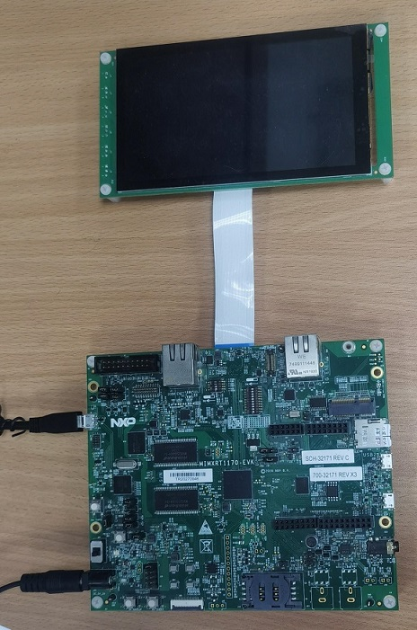

# NXP Application Code Hub
[](https://www.nxp.com)

## AN13778: Porting VGLite Driver for Bare Metal or Single Task
The VGLite middleware includes VGLite driver, font and text draw API, and VGLite Elementary Library. The VGLite driver provides a set of native APIs that supports 2D vector-based and 2D raster-based operations. It can be used as the interface to 2D GPU hardware in the NXP i.MX RT500, i.MX RT1160, and i.MX RT1170 series chips. Font and text draw API and VGLite Elementary Library are based on the native API. All API and library in the VGLite middleware are platform independent and the implementation in the NXP MCUXpresso SDK is only for FreeRTOS.

This document:
- outlines the middleware components and driver architecture, including folder hierarchy
and brief description of each folder.
- analyzes how driver supports multiple tasks, especially command buffers management
to support multi-task.
- gives the driver porting for bare metal in details.
- provides the porting for RTOS to support single task

Please refer to AN13778 for complete instructions on how to use this software.

https://www.nxp.com/docs/en/application-note/AN13778.pdf

#### Boards: MIMXRT1170-EVK, MIMXRT1170-EVKB
#### Categories: Graphics
#### Peripherals: DISPLAY
#### Toolchains: IAR

## Table of Contents
1. [Software](#step1)
2. [Hardware](#step2)
3. [Setup](#step3)
4. [Results](#step4)
5. [FAQs](#step5) 
6. [Support](#step6)
7. [Release Notes](#step7)

## 1. Software<a name="step1"></a>

The software for this Application Note is delivered in raw source files and IAR projects.
- MCUXpresso SDK 2.11.0
- IAR Embedded Workbench for Arm, Version is 9.20.2 or later

## 2. Hardware<a name="step2"></a>

- MIMXRT1170-EVK (all Rev boards are supported)
- RK055HDMIPI4M or RK055HDMIPI4MA0 MIPI display panel
- Micro USB Cable
- Personal computer



## 3. Setup<a name="step3"></a>
1. Connect a USB cable between the host PC and the OpenSDA USB ort on the target board.
1. Open a serial terminal with the following settings:
   - 115200 baud rate
   - 8 data bits
   - No parity
   - One stop bit
   - No flow control
1. Open an example under boards\evkmimxrt1170\vglite_examples\
1. Change the display definition in display_support.h for your display panel.
1. Change build configuration, default configuratin is *sdram_debug*, and compile the example project.
1. Download the built image to the board through OpenSDA USB port and run the example.

## 4. Results<a name="step4"></a>

The similar log below shows the output of the examples in the terminal window:
```
60 frames in 2110 mSec: 28.436 FPS
60 frames in 2120 mSec: 28.301 FPS
60 frames in 2155 mSec: 27.842 FPS
```
At the same time, the 2D graphics assets are rendered on the screen. The examples of bare metal has a name with **_bm** suffix. They have no log output in the termial windows but same graphic content showed on the screen as that of counterpart example of multitask or single task.

## 5. FAQs<a name="step5"></a>

**Q**: How can I run the examples with VGLite driver of single task?

**A**: The default project of examples whose name has no **_bm** suffix are for multitask. To build and run these examples with single task support, you need to remove the files under `VGLite/rtos` from the default project, instead, add the fils under `VGLite/rtos_single_task` into the project, then define the preprocessor variable **ONE_TASK_SUPPORT**.

## 6. Support<a name="step6"></a>

The details for this demo are all recorded in the application note - [AN13778](https://www.nxp.com/docs/en/application-note/AN13778.pdf) Porting VGLite Driver for Bare Metal or Single Task.

#### Project Metadata
<!----- Boards ----->
[](https://github.com/search?q=org%3Anxp-appcodehub+MIMXRT1170-EVK+in%3Areadme&type=Repositories) [](https://github.com/search?q=org%3Anxp-appcodehub+MIMXRT1170-EVKB+in%3Areadme&type=Repositories)

<!----- Categories ----->
[](https://github.com/search?q=org%3Anxp-appcodehub+graphics+in%3Areadme&type=Repositories)

<!----- Peripherals ----->
[](https://github.com/search?q=org%3Anxp-appcodehub+display+in%3Areadme&type=Repositories)

<!----- Toolchains ----->
[](https://github.com/search?q=org%3Anxp-appcodehub+iar+in%3Areadme&type=Repositories)

Questions regarding the content/correctness of this example can be entered as Issues within this GitHub repository.

>**Warning**: For more general technical questions regarding NXP Microcontrollers and the difference in expected funcionality, enter your questions on the [NXP Community Forum](https://community.nxp.com/)

[](https://www.youtube.com/@NXP_Semiconductors)
[](https://www.linkedin.com/company/nxp-semiconductors)
[](https://www.facebook.com/nxpsemi/)
[](https://twitter.com/NXP)

## 7. Release Notes<a name="step7"></a>
| Version | Description / Update                           | Date                        |
|:-------:|------------------------------------------------|----------------------------:|
| 1.0     | Initial release on Application Code HUb        | June 12<sup>th</sup> 2023 |

